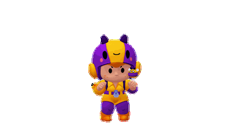

# Беа и пчела — питомец DeepSeek Harness



Беа 2.0 использует готовый движок [PC2005-cloud/dsh-pet](https://github.com/PC2005-cloud/dsh-pet), версия **0.3.1**. Она гуляет, поворачивается, реагирует на клик, перетаскивание и состояние работы Harness. Движения из игры воспроизводятся в прозрачных видео **640 × 360, 30 кадров/с**.

## Установка и обновление

Нужен **Node.js 22.12 или новее** с npm. Останови Harness перед установкой. На рабочем Linux скачай этот репозиторий через **Code → Download ZIP** либо клонируй:

```sh
git clone https://github.com/KlyzhenkoVadim/dsh-bea-pet.git
cd dsh-bea-pet
npm exec --yes --package=@deepseek-ai/dsh@0.2.0-rc.2 --package=pnpm@10.34.6 -- node scripts/install.mjs
```

Если репозиторий уже скачан, сначала обнови его через `git pull`. Та же команда обновляет прототип 1.0 до версии 2.0 и подключает новый движок вместо старого. Старые настройки прототипа остаются на диске.

Запусти Harness привычным способом либо:

```sh
npx --yes @deepseek-ai/dsh@0.2.0-rc.2 web
```

Беа появится внизу справа. Используй **Chrome, Chromium, Edge или Firefox**: опубликованный движок использует прозрачный WebM. Safari/WKWebView не поддерживают его прозрачность.

По умолчанию питомец живёт в странице Harness. Для отдельного питомца поверх рабочего стола на Linux добавь к команде установки `--display desktop`, для обоих режимов — `--display both`. Движок при первом включении рабочего стола скачивает Electron; нужна графическая сессия. На Wayland может понадобиться XWayland. Поддержка этого режима предоставляется движком; проверка на реальном Linux ещё не выполнена.

Профиль по умолчанию — `web`. Другой профиль задаётся `--profile имя`. Если Harness использует нестандартную папку данных, запускай установку с той же переменной `DSH_HOME`.

## Управление

- Клик — полная игровая победная анимация с прыжком.
- Перетаскивание и бросок — реакция Беа и физика движка.
- Правый клик — меню действий и поведения движка.
- Настройки Harness → раздел питомца — размер, положение, реакции на работу и режим отображения.
- Начало работы — перезарядка; выполнение инструмента — атака; ожидание подтверждения — спокойное ожидание; успех — победа; ошибка — поражение. Привязка использует штатные события движка.

Автоматические разговоры, проверка баланса и отдельные уведомления выключены. Для обычных анимаций запросы к модели не нужны. Пункт разговора в меню движка можно использовать отдельно с провайдером, настроенным в Harness.

## Перенос настроек

Готовые настройки лежат в `settings/bea-config.json`, ролики — в `assets/bea-video/`. Установщик копирует их в `$DSH_HOME/dsh-pet/` (обычно `~/.dsh/dsh-pet/`). Ключи доступа, токены и история разговоров в комплект не входят.

Если движок уже установлен:

```sh
node scripts/install.mjs --settings-only
```

Повторная установка сохраняет изменённый размер и поведение Беа. Перед обновлением её файла настроек создаётся резервная копия. Если уже настроен другой питомец dsh-pet, Беа добавляется отдельным пакетом в `pet/bea-config.json` и `pet/bea-animation/`; существующая конфигурация сохраняется. Отдельное подключение `dsh-pet` в профиле заменяется подключением через комплект Беа, чтобы движок не запускался дважды. Такой дополнительный пакет редактируется в файле, основные настройки интерфейса движка относятся к главному пакету.

Для переноса именно своих изменённых настроек скопируй `~/.dsh/dsh-pet/main-config.jsonc` на новый компьютер после установки. Если Беа добавлена отдельным пакетом, копируй `pet/bea-config.json`. Положение после перетаскивания может храниться локально в браузере.

## Анимации и источники

| Ролик | Основа |
|---|---|
| `bea-idle`, `bea-walk` | Игровое ожидание и ходьба |
| `bea-attack`, `bea-reload` | Игровая атака и перезарядка |
| `bea-win`, `bea-lose` | Полные игровые победа и поражение |
| `bea-turn` | Плавный поворот камеры вокруг модели |
| `bea-drag` | Переход к единственной игровой позе отбрасывания и обратно |

Пчела использует свою игровую анимацию ожидания с добавленным плавным парением. Глаза Беа восстановлены как отдельные поверхности, привязанные к голове. Это заранее отрендеренная 3D-модель; во время работы питомца движок воспроизводит видео.

Беа, пчела, модели, текстуры и исходные движения принадлежат **Supercell / Brawl Stars**. Материалы получены из открытых игровых архивов; ссылки и подробности — в `ATTRIBUTION.txt`. Движок dsh-pet распространяется по MIT. Эта лицензия не распространяется на материалы игры. Фанатский проект для личного использования, не официальный продукт Supercell или DeepSeek.

## Проверка

Проверено на macOS в изолированном Harness **0.2.0-rc.2**: установка готового архива, загрузка опубликованного движка **0.3.1**, прозрачное воспроизведение, победная анимация по клику и сохранение размера через Pet Config. Проверены все восемь роликов, полнота кадра, импорт настроек и сохранение чужой конфигурации. Реальные запросы к модели и отдельное окно на Linux пока не проверены.

## Сборка

Исходники адаптера и установщика — `lib/` и `scripts/`. Ролики уже готовы: Blender и Python для установки не нужны. Для пересборки установочного архива после изменения пакета:

```sh
npm pack
node scripts/install.mjs --check
```

Готовый архив — `bea-harness-pet-2.0.1.tgz`. Старый спрайтовый вариант `assets/bea/` оставлен для совместимости и не входит в новый установочный архив.
