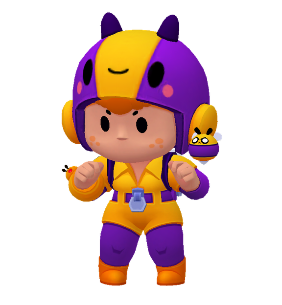

# Беа с пчелой — питомец DeepSeek Harness



Готовый фанатский питомец с девятью анимациями. Беа живёт внутри страницы Harness, реагирует на начало работы, завершение и ошибку. Её можно перетаскивать, нажать для прыжка и настроить через шестерёнку.

Проверено на macOS с **DeepSeek Harness 0.2.0-rc.2**, браузерный профиль **web**. Установщик написан без привязки к этому Mac; установка на Windows и Linux пока не проверена. Поддержка отдельного приложения Desktop пока не проверена.

## Перенос на другой компьютер

Нужен Node.js с npm. Если Harness уже запущен, останови его перед установкой.

1. Скачай этот репозиторий через **Code → Download ZIP** и распакуй его либо клонируй:

   ```sh
   git clone https://github.com/KlyzhenkoVadim/dsh-bea-pet.git
   cd dsh-bea-pet
   ```

2. Открой терминал в папке репозитория и выполни:

   ```sh
   npm exec --yes --package=@deepseek-ai/dsh@0.2.0-rc.2 --package=pnpm@10.34.6 -- node scripts/install.mjs
   ```

   Команда устанавливает плагин в профиль `web` и импортирует настройки Беа. Уже существующий файл её настроек предварительно сохраняется в резервной копии.

3. Запусти Harness обычным способом. Если он ещё не установлен как команда:

   ```sh
   npx --yes @deepseek-ai/dsh@0.2.0-rc.2 web
   ```

   Беа появится внизу справа. Доступ к DeepSeek на новом компьютере настрой отдельно через обычный интерфейс Harness.

Для другого браузерного профиля добавь в конец команды установки `--profile имя-профиля`. Если используешь нестандартную папку данных, перед запуском установщика задай ту же переменную `DSH_HOME`, с которой работает твой Harness.

## Какие настройки перенесены

В `settings/preferences.json` сохранены выбранная Беа, включённое состояние и большой размер — 224 пикселя. Ключи доступа, токены, история разговоров и общие настройки Harness в комплект не входят. Положение питомца хранится в браузере: на новом компьютере он начнёт внизу справа.

Если плагин уже установлен и нужно только импортировать настройки:

```sh
node scripts/install.mjs --settings-only
```

После импорта перезапусти Harness. Настройки сохраняются в `~/.dsh/bea-pet/preferences.json` либо в соответствующем подкаталоге `DSH_HOME`.

## Возможности и проверка

Есть ожидание, ходьба в обе стороны, радость, прыжок, работа, ожидание ответа, ошибка и осмотр. Шестерёнка позволяет посмотреть каждую анимацию вручную. Автоматическое ожидание ответа пока не подключено.

Проверены установка архива штатным менеджером плагинов, запуск установленной копии в Harness 0.2.0-rc.2, отображение Беа, анимации, сохранение размера и импорт настроек с резервной копией. Реакции на реальные запросы модели отдельно не проверялись.

## Состав

- `lib/`, `assets/`, `cordis.patch.yml`, `package.json` — исходники плагина и Беа.
- `bea-harness-pet-1.0.0.tgz` — готовый пакет для установки.
- `scripts/install.mjs` — установка и импорт настроек.
- `settings/preferences.json` — переносимые настройки Беа.
- `UPSTREAM-LICENSE.txt` — лицензия исходного кода сервиса.

Архив собран из исходников в этом репозитории. После изменений исходников пересобери его командой `npm pack`; установщик использует готовый архив.

## Источники и авторство

Беа, пчела, исходные модели, текстуры и анимации принадлежат **Supercell / Brawl Stars**. Файлы взяты из [tailsjs/brawl-stars-assets](https://github.com/tailsjs/brawl-stars-assets); глаза добавлены при подготовке модели. Дополнительные сведения — в `assets/bea/ATTRIBUTION.txt`.

Сервис основан на [Luv061211/dsh-pet](https://github.com/Luv061211/dsh-pet), лицензия MIT сохранена. Клиент и хранение настроек адаптированы для Harness 0.2. Лицензия исходного сервиса не распространяется на игровые материалы Supercell.

Фанатский питомец для личного использования; не официальный продукт Supercell или DeepSeek.
